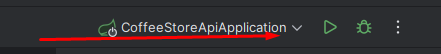
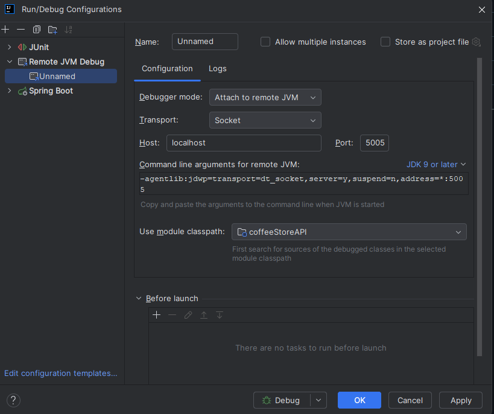

# Coffee Store API

A Spring Boot application for managing coffee orders with discount capabilities.

## Project Overview

The Coffee Store API is a RESTful service that allows users to create, retrieve, and manage coffee orders. It includes features such as:

- Creating new coffee orders
- Retrieving order details
- Listing all orders
- Applying discounts based on configurable rules

## Prerequisites

- Java 21
- Maven 3.6+
- Docker and Docker Compose (optional, for containerized deployment)
- PostgreSQL (automatically set up with Docker Compose)

## Building the Application

To build the application, run:

```bash
mvn clean package
```

This will compile the code, run tests, and create a JAR file in the `target` directory.

## Running the Application Locally

To run the application locally, run the following command:

```bash
mvn clean package -DskipTests 
```
And then run the JAR file in docker as a daemon:
```bash
docker-compose up -d --build 
```
I recommend to do it without the daemon flag to see the logs in the console:
```bash
docker-compose up --build
```

## Debugging the Application

### Local Debugging

When you run the application in Docker you can remote debug the application. That means you create a new run configuration in your IDE (e.g., IntelliJ IDEA) to connect to the running Docker container.

### How to do that in IntelliJ?
- Click here to edit or add a run configuration.



After that click to the top left to add a new ```Remote JVM debug``` configuration.

If the port is not 5005 then change it to 5005. The end result should look like this:


Then connect your IDE to port 5005.

## Configuration

The application uses environment variables for configuration:

- `SPRING_DATASOURCE_URL` - JDBC URL for the PostgreSQL database
- `SPRING_DATASOURCE_USERNAME` - Database username
- `SPRING_DATASOURCE_PASSWORD` - Database password

Feature flags can be configured in the `application.yaml` file:

```yaml
discounts:
  enabled: true
  twenty-five-percent: true
  free-item-after-three: true
```